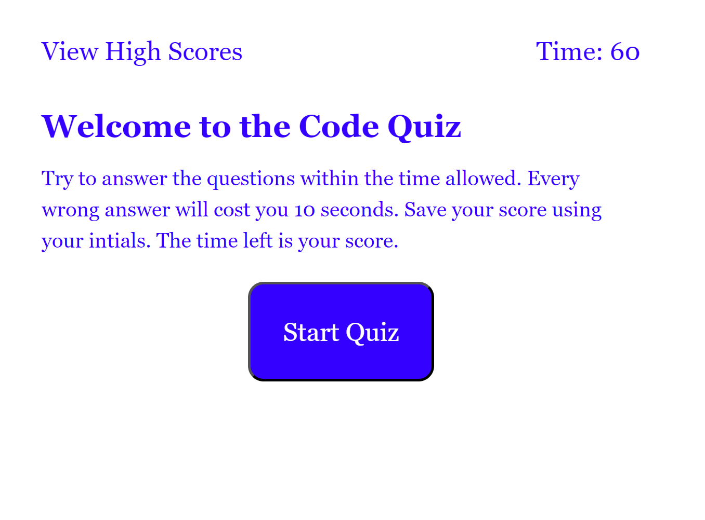

# Classmate Code Quiz

# Screenshot

,
,

# Link to live site
https://jweaver74.github.io/Classmate-Code-Quiz/

## Why I made this site
I created this Coding Quiz to develop and show what i have learned within Javascript.
Adding JS to the HTML and CSS that i created for the Coding Quiz.

## What I learned
I learned that there are definitively more ways to create JS for a single use.  Learned how to correctly use JSON within JS, 
how to event listeners for buttons, along with resetting state funstion to restore the inital values.

## Challenges 
Trying to keep everything orginized within JS was a big challenge for me. Going back and forth from top to bottom to make sure the 
correct functions were used with the correct VAR. Trying to correct the errors along the way was an even bigger challenge due to 
a mis-spelled word that i wouldnt see even though i looked over and over. I need to work on my cascading orginization along with my spelling.

## credits
BCS learning Asssistant-ask-235198

SMU Tutor

Simple steps Code-https://simplestepscode.com/javascript-quiz-tutorial/

W3 Schools-https://www.w3schools.com/js/default.asp

Geeksforgeeks-https://www.geeksforgeeks.org/how-to-create-a-simple-javascript-quiz/

youtube-https://www.youtube.com/watch?v=f4fB9Xg2JEY